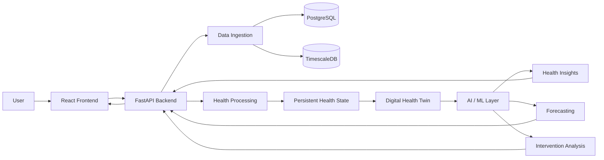

<div align="center">

# Digital Health Twin

### *Simulating tomorrow’s health decisions — today.*

**An AI-powered platform for personalized health intelligence, monitoring, forecasting, and decision support.**

</div>

---

Digital Health Twin is an AI-powered health intelligence platform designed to create a personalized digital representation of an individual's health state.

The platform combines health data, AI-driven analysis, predictive modeling, and personalized insights to help users understand their current health state, explore potential future outcomes, and evaluate possible health-related interventions.

---

## Table of Contents

* [Overview](#overview)
* [Problem Statement](#problem-statement)
* [Proposed Solution](#proposed-solution)
* [Key Features](#key-features)
* [Core Concept](#core-concept)
* [How It Works](#how-it-works)
* [System Architecture](#system-architecture)
* [Data Flow](#data-flow)
* [Technology Stack](#technology-stack)
* [Project Structure](#project-structure)
* [Getting Started](#getting-started)
* [Example Workflow](#example-workflow)
* [Limitations](#limitations)
* [Future Scope](#future-scope)
* [Project Status](#project-status)
* [Vision](#vision)

---

## Overview

Traditional health applications often present health information as isolated measurements, charts, or historical records. While useful for monitoring, these systems do not necessarily maintain a persistent representation of how an individual's health state evolves over time.

Digital Health Twin approaches this problem by representing an individual's health as an evolving digital state.

Instead of treating every health measurement independently, the platform is designed around three interconnected concepts:

* **Observations** — Data collected from health and physiological sources.
* **Health State** — A persistent representation of the individual's current health state.
* **Dynamics** — AI-driven analysis, forecasting, and potential intervention effects.

This architecture provides the conceptual foundation for moving from static health monitoring toward personalized health simulation and decision support.

---

## Problem Statement

Health information is often fragmented across different sources such as wearable measurements, laboratory results, and clinical data.

Conventional health dashboards primarily focus on displaying these observations. This creates several limitations:

* Health measurements may remain isolated from one another.
* Historical data does not necessarily form a persistent representation of the user's health state.
* Users may have difficulty understanding how different health factors interact.
* Static dashboards provide limited support for exploring potential future outcomes.
* Health-related decisions are often made without a unified representation of an individual's evolving health profile.

The underlying challenge is therefore not simply collecting more health data, but transforming that data into a continuously evolving representation that can support analysis and future-oriented reasoning.

---

## Proposed Solution

Digital Health Twin proposes a personalized digital health representation that evolves as new health information becomes available.

The system can be viewed as a pipeline:

```text
Health Data
     |
     v
Data Processing
     |
     v
Health State
     |
     v
Digital Health Twin
     |
     v
AI Analysis
     |
     +------------------+------------------+
     |                  |                  |
     v                  v                  v
  Insights         Forecasting      Interventions
     |                  |                  |
     +------------------+------------------+
                        |
                        v
              Personalized Decisions
```

The core idea is to maintain a persistent health state rather than treating each observation as an independent event.

As new information is introduced, the representation can be updated and used as the basis for analysis, forecasting, and intervention-oriented exploration.

---

## Key Features

### Personalized Digital Health Twin

Creates a virtual representation of an individual's health state.

The twin is intended to evolve as new physiological and clinical information becomes available.

### Health Data Visualization

Provides a way to visualize health-related information and track changes in an individual's health profile.

### AI-Powered Health Insights

Uses AI and machine learning concepts to analyze health information and identify meaningful patterns within the available data.

### Health Forecasting

Provides a framework for exploring potential future health outcomes based on the individual's available health state and data.

### Intervention Simulation

The Digital Health Twin architecture supports the concept of applying potential interventions to the represented health state and examining their possible effects.

### Personalized Recommendations

Generates health-related insights and recommendations based on the individual's represented health profile.

### Interactive AI Health Assistant

Provides an AI-powered conversational interface through which users can interact with and explore their health information.

### Privacy-Focused Architecture

The system is designed with privacy-aware handling of sensitive health information as an architectural consideration.

### API-Based Architecture

The platform is structured around APIs to support communication between the frontend, backend, AI components, and external health-related services.

---

## Core Concept

Digital Health Twin separates health information into three major layers.

```text
+-----------------------------+
|         OBSERVATIONS        |
|                             |
| Wearables                   |
| Laboratory Data             |
| Clinical Data               |
+--------------+--------------+
               |
               v
+-----------------------------+
|         HEALTH STATE        |
|                             |
| Persistent Twin             |
| Personalized Health Memory  |
+--------------+--------------+
               |
               v
+-----------------------------+
|           DYNAMICS          |
|                             |
| AI Models                   |
| Forecasts                   |
| Intervention Effects        |
+-----------------------------+
```

### 1. Observations

The observation layer represents incoming health information.

Examples include:

* Wearable measurements
* Laboratory results
* Clinical information
* Other available physiological data

### 2. Health State

The health-state layer represents the individual's persistent digital health state.

Rather than storing observations only as isolated values, this layer provides the conceptual foundation for maintaining a personalized representation of the individual.

### 3. Dynamics

The dynamics layer represents processes that can operate on the health state.

This includes:

* AI-driven analysis
* Forecasting
* Potential intervention effects
* Future health-state exploration

This separation allows the system to distinguish between **what has been observed**, **what the current health state represents**, and **how that state may evolve**.

---

## How It Works

The overall workflow can be represented as:

```text
                 +----------------+
                 |   Health Data  |
                 +-------+--------+
                         |
                         v
                 +----------------+
                 | Data Ingestion |
                 +-------+--------+
                         |
                         v
                 +----------------+
                 | Data Processing|
                 +-------+--------+
                         |
                         v
                 +----------------+
                 | Health State   |
                 | Generation     |
                 +-------+--------+
                         |
                         v
                 +----------------+
                 | Digital Health |
                 | Twin           |
                 +-------+--------+
                         |
                         v
                 +----------------+
                 | AI Analysis    |
                 +-------+--------+
                         |
          +--------------+--------------+
          |              |              |
          v              v              v
      Insights      Forecasting   Interventions
          |              |              |
          +--------------+--------------+
                         |
                         v
              Personalized Decisions
```

### Step 1 — Health Data

Health-related information is introduced into the system from available sources.

### Step 2 — Data Ingestion

Incoming information enters the platform through the data ingestion layer.

### Step 3 — Data Processing

The collected information is processed into a form that can contribute to the user's health representation.

### Step 4 — Health State Generation

Processed information contributes to the individual's represented health state.

### Step 5 — Digital Health Twin

The resulting state forms the basis of the personalized Digital Health Twin.

### Step 6 — AI Analysis

AI and machine learning components can analyze the represented health state to derive insights and support forecasting.

### Step 7 — Insights, Forecasting, and Interventions

The system can use the health state for:

* Health insights
* Future outcome exploration
* Intervention-oriented simulation

### Step 8 — Personalized Decision Support

The resulting information is presented as personalized insights intended to support more informed health-related decisions.

---

## System Architecture

The following represents the conceptual architecture of Digital Health Twin based on the provided system design.



### Architecture Components

| Component           | Responsibility                                                   |
| ------------------- | ---------------------------------------------------------------- |
| React Frontend      | User-facing health interface and visualization                   |
| FastAPI Backend     | API layer and backend application logic                          |
| Data Ingestion      | Receives and processes incoming health information               |
| Health Processing   | Converts available information into the represented health state |
| PostgreSQL          | Structured health data storage                                   |
| TimescaleDB         | Time-series health data storage                                  |
| Digital Health Twin | Persistent representation of the individual's health state       |
| AI / ML Layer       | Analysis, forecasting, and intervention-oriented processing      |

> The architecture diagram represents the project's described architecture and conceptual system flow. Specific implementation details may evolve during development.

---

## Data Flow

The primary data flow through the system is:

```text
+----------------+
| Health Sources |
+-------+--------+
        |
        v
+----------------+
| Data Ingestion |
+-------+--------+
        |
        v
+----------------+
| Data Processing|
+-------+--------+
        |
        v
+----------------+
| Health State   |
+-------+--------+
        |
        v
+----------------+
| Digital Twin   |
+-------+--------+
        |
        v
+----------------+
| AI / ML Layer  |
+-------+--------+
        |
        +----------------+
        |                |
        v                v
    Forecasts        Insights
        |                |
        +-------+--------+
                |
                v
       User Decision Support
```

The important distinction is that the Digital Health Twin sits between raw observations and downstream AI-driven analysis.

This allows the system to reason about an evolving health state rather than relying exclusively on individual observations.

---

## Technology Stack

| Layer            | Technology                              |
| ---------------- | --------------------------------------- |
| Frontend         | React                                   |
| Backend          | Python, FastAPI                         |
| AI / ML          | Large Language Models, Machine Learning |
| Database         | PostgreSQL                              |
| Time-Series Data | TimescaleDB                             |
| APIs             | REST APIs                               |
| Deployment       | Docker                                  |

The listed technologies represent the project's provided technology stack. Specific libraries, models, cloud providers, and third-party integrations are not specified here.

---

## Project Structure

A high-level organization of the project can be represented as:

```text
digital-health-twin/
|
+-- frontend/
|   +-- React application
|
+-- backend/
|   +-- FastAPI application
|   +-- API routes
|   +-- Health processing
|   +-- AI / ML integration
|
+-- requirements.txt
+-- README.md
```

> The exact repository structure may differ depending on the current implementation.

---

## Getting Started

### Prerequisites

The project requires:

* Python
* pip
* Node.js and npm
* PostgreSQL
* TimescaleDB
* Docker

### Clone the Repository

```bash
git clone https://github.com/orni-codes/digital-health-twin.git
cd digital-health-twin
```

### Install Backend Dependencies

```bash
pip install -r requirements.txt
```

### Start the Backend

```bash
python app.py
```

### Start the Frontend

```bash
cd frontend
npm install
npm run dev
```

The frontend will start using the local development server configured by the project.

> Database configuration, environment variables, API keys, and production deployment instructions should be added once those details are finalized in the project.

---

## Example Workflow

A typical user interaction with the Digital Health Twin can be represented as:

```text
Connect Health Data
        |
        v
Generate / Update Twin
        |
        v
Monitor Health State
        |
        v
Analyze Health Patterns
        |
        v
Forecast Possible Outcomes
        |
        v
Explore Interventions
        |
        v
Generate Personalized Insights
```

The intended experience moves from **data collection** to **persistent health representation**, followed by **analysis and future-oriented exploration**.

---

## Limitations

Digital Health Twin is currently under active development. The following limitations should therefore be considered:

* The system is not presented as a replacement for professional medical advice.
* Forecasting depends on the quality and availability of health data.
* AI-generated insights may require validation before being used for health-related decisions.
* The exact capabilities of the forecasting and intervention models depend on their implementation.
* External health-service integrations are dependent on the availability and configuration of those services.
* Production-level security, compliance, and clinical validation are not established by the information currently provided.

---

## Future Scope

Potential areas for further development include:

* Expanding health-data integrations
* Improving the persistent health-state representation
* Developing more advanced forecasting models
* Improving intervention simulation
* Expanding AI-powered health insights
* Enhancing health-data visualization
* Adding additional external health-service integrations
* Strengthening privacy and security mechanisms
* Improving the AI health assistant
* Developing more comprehensive reporting capabilities

These represent potential future directions rather than confirmed implemented functionality.

---

## Project Status

**Active Development**

Digital Health Twin is currently under active development.

The project is being developed toward a system capable of combining personalized health data, persistent health-state representation, AI analysis, forecasting, and intervention-oriented exploration within a single platform.

---

## Vision

The long-term vision of Digital Health Twin is to move health intelligence from **static health records toward dynamic, personalized health simulation**.

Rather than simply asking:

> What happened to my health?

the platform is designed around a broader question:

> Given my current health state, what could happen next, and how might different decisions affect that trajectory?

By maintaining a persistent representation of an individual's health state and combining it with AI-driven analysis, Digital Health Twin aims to provide a foundation for more personalized and forward-looking health intelligence.

---

## Repository

GitHub: https://github.com/orni-codes/digital-health-twin

---

## Keywords

Digital Health Twin, Digital Twin, Health Intelligence, Artificial Intelligence, Machine Learning, Health Forecasting, Personalized Health, Health Data, Predictive Health, FastAPI, React, PostgreSQL, TimescaleDB
